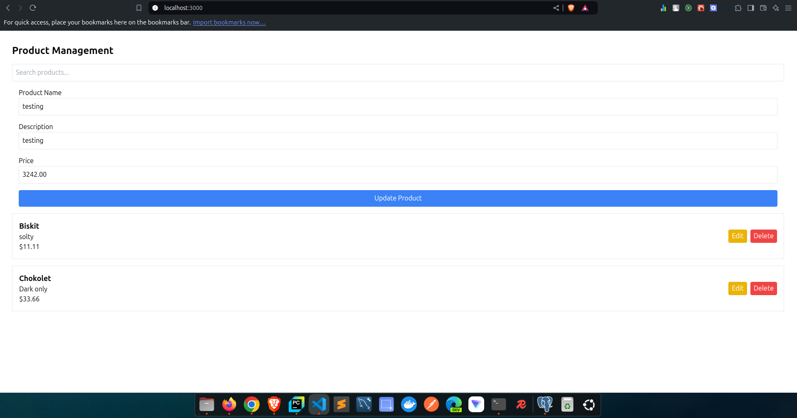

# Backend
Note: During backend development used **python 3.12** and **django 5.1.1** version
1. Create virtual environtment  
    ~ `python3 -m venv venv`
2. Activate virtual environment  
    ~ For linux  
        ~ `source venv/bin/activate`  
    ~ For windows  
        ~ `venv\Scripts\activate`
3. Install package manager **Poetry**  
    ~ `pip install poetry`  
4. Install dependency package  
    ~ `poetry install`
5. As this project developed on python3.12 version and django==5.1.1 version, if you face any python version issue please install bellow 3 packages directly.  
    ~ `pip install Django`  
    ~ `pip install djangorestframework`  
    ~ `pip install django-cors-headers`  
6. Now run migrate command  
    ~ `python manage.py migrate`
7. Run the server  
    ~ `python manage.py runserver`

# Frontend
Note: During frontend development used **node v20.11.1** and **npm 10.8.3** version
1. Use `React` inside `Next.js` framework and for CSS `Tailwind CSS`
2. Install dependency: `npm install`
3. Run the project: `npm run dev`
4. Access project in browser: `localhost:3000`

